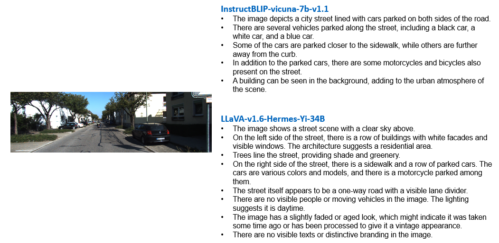

# Visual-Language Guided Semantic Scene Completion

This repository is an extension of [3DSSC](https://github.com/LuckyMax0722/3DPNA). For detailed information, please refer to the main repository. Currently, this repository supports both **LAVIS: A Library for Language-Vision Intelligence** and **LLaVA: Large Language and Vision Assistant**.

## 0. Demo


## 1. Installation

### 1.1 Foundation Model Installation

- For **LAVIS**: Please refer to the [LAVIS Installation](https://github.com/salesforce/LAVIS?tab=readme-ov-file#installation) instructions.
- For **LLaVA**: Please refer to the [LLaVA Installation](https://github.com/haotian-liu/LLaVA?tab=readme-ov-file#install) instructions.

### 1.2 Installing Additional Dependencies

Install the required packages using the following command:

```bash
pip install easydict pytorch-lightning==2.3.3
```

### 1.3 Building this Repository

After installing the dependencies, compile the repository by running:

```bash
git clone https://github.com/LuckyMax0722/VLGSSC
cd VLGSSC
pip install -e .
```

## 2. Datasets

For dataset installation, please refer to [3DSSC](https://github.com/LuckyMax0722/3DPNA). Currently, this repository supports the following datasets:

* [**KITTI**](https://www.cvlibs.net/datasets/kitti/eval_odometry.php) and [**SemantiKITTI**](https://www.semantic-kitti.org/dataset.html)

## 3. Usage

The functionality of this repository is divided into two parts:

* **Image-to-Text**: Generate scene descriptions from images and save them as .txt file.
* **Text-to-Feature**: Generate text features from scene descriptions and save them as .npy file.

## 3.1 Image-to-Text

The following models are supported for this task:

* InstructBLIP (based on LAVIS)
* LLaVA

By running the following code, you can easily obtain descriptions for all images in the dataset.

```bash
python /path/to/VLGSSC/core/pl_tools/pl_blip_predict.py
```

or 

```bash
python /path/to/VLGSSC/core/pl_tools/pl_llava_predict.py
```

## 3.2 Text-to-Feature

The following models are supported for this task:

* Q-Former (based on LAVIS)
* CLIP
* Long-CLIP

By running the following code, you can easily obtain descriptions for all images in the dataset.

Tips: you can choose to use Q-Former or CLIP by setting the **feat_extractor_model** in pl_blip2_extractor.py

```bash
python /path/to/VLGSSC/core/pl_tools/pl_blip2_extractor.py
```

or

```bash
python /path/to/VLGSSC/core/pl_tools/pl_longclip_extractor.py
```
